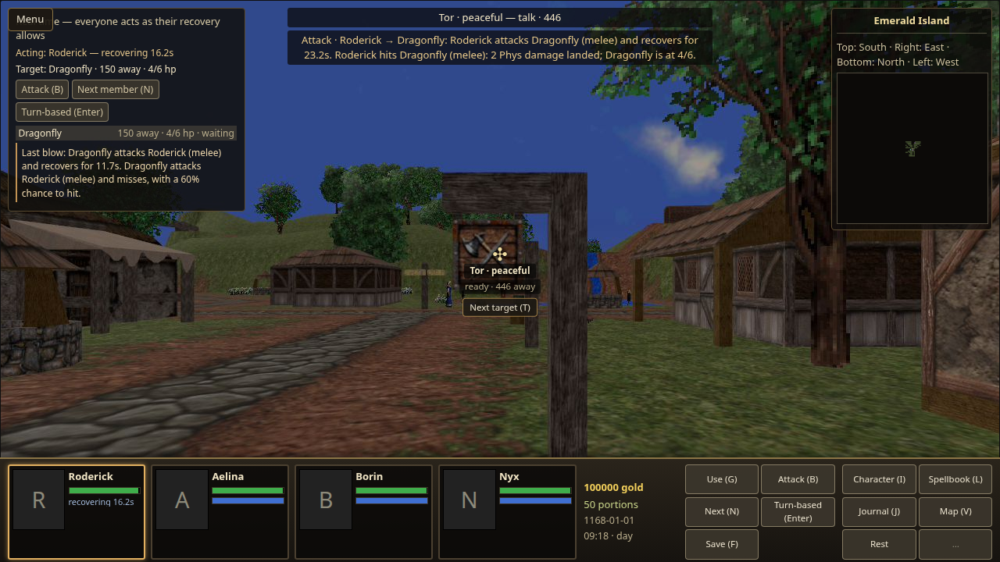
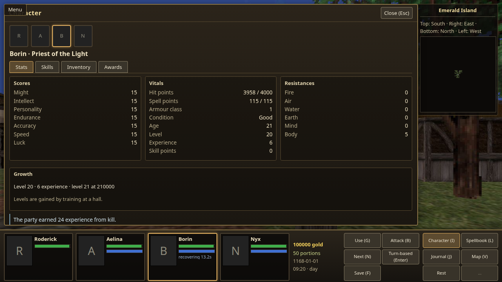
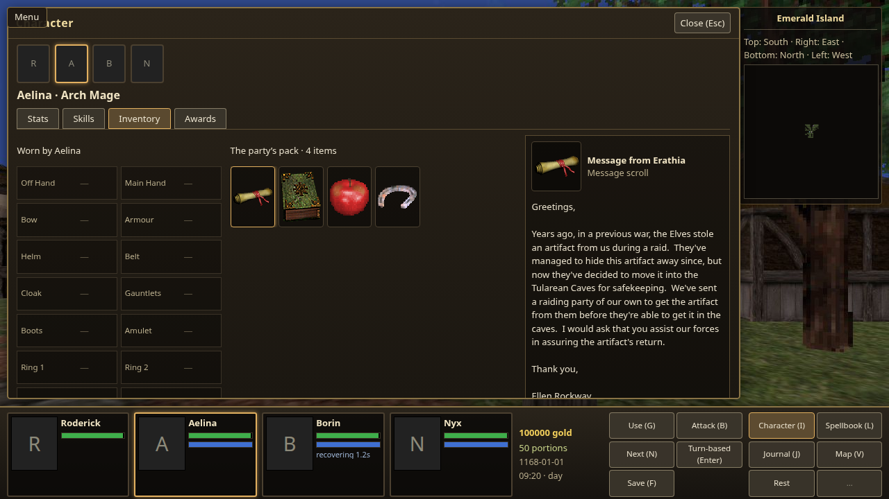
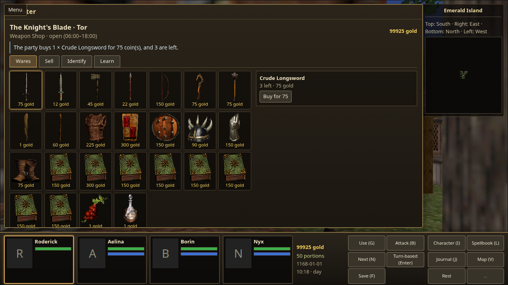
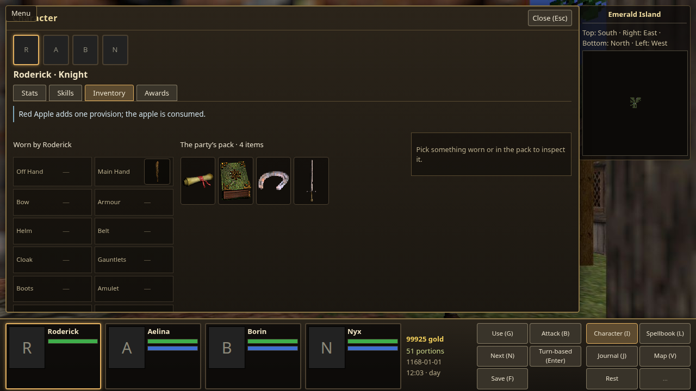
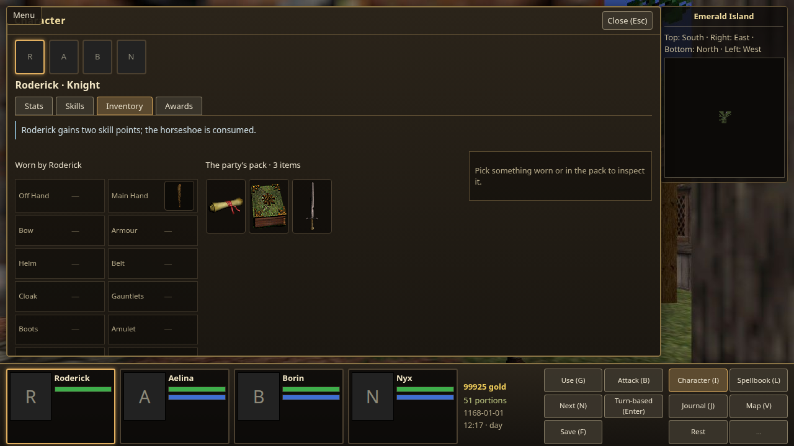
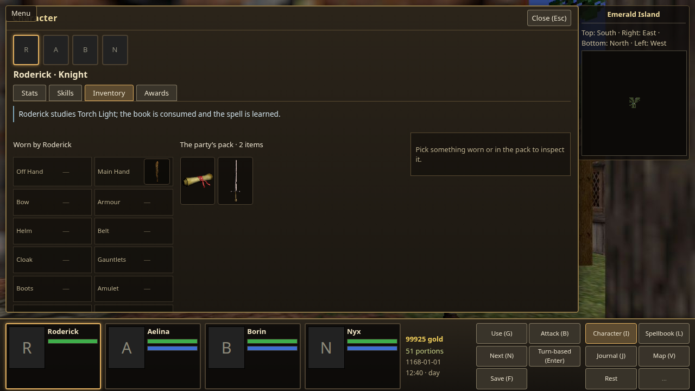
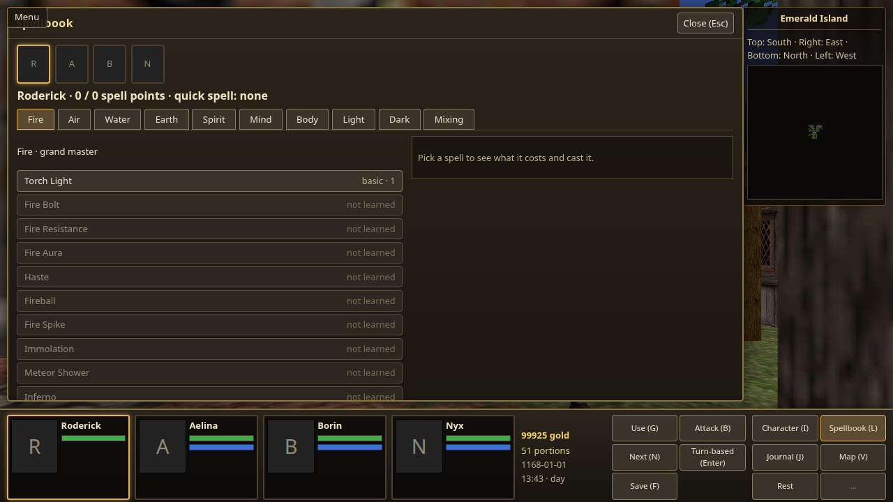

# Full content validation

Recorded for Den task #8511 on 5 October 2026 (provenance only).
The operator's English Update v. 1.1 installation supplied the data. The JSON reports record identities and digests rather than reproducing source
tables or reading prose. Screenshots show the operator-supplied assets in play;
the imported packs themselves are not distributed.

## Reproduction and coverage

Run the importer into a fresh content root, then set `CRAWLER_IMPORTED_CONTENT` to
that root and `CRAWLER_CONTENT_REPORT` to an output file while running
`ContentSetInventoryTests`. The generated [inventory](content-set-inventory.json)
records table digests, counts, policy owners, each item identity's interpretation,
and explicit limits. [Service exclusions](content-service-exclusions.json) records
all omitted building identities and the importer's reasons.

The sweep loads the ordinary bundle and validates 276 monsters, 800 item rows,
99 spells, 37 skill rows, and 136 placed counters. Every monster becomes a real
population entity and resolves an attack against a party through `CombatState`.
Every item is acquired as a unique instance; every wearable item is equipped and
returned. All 99 spell books teach their corresponding spell and are consumed
through the ordinary item-use rule, with eligible promoted classes representing
both paths. Every counter's stock and spell/skill lessons resolve to declared
identities. Synthetic positions and trained characters isolate this content check;
they do not prove ordinary acquisition or every original placement.

## Policy and exclusions

Class ceilings, guild requirements, calendar and race creation ranges use the
existing compiled ruleset policy owners recorded in the report. They are not
invented per imported row. Club is the donor's always-known novice skill:
OpenEnroth `src/Engine/Objects/Character.cpp:6742`. It adds no trainable 38th skill.
Its attack bonus and recovery are checked through a session attack.

There are 72 nonempty readable messages. The other 21 message-scroll item rows
have empty or absent source text, and remain represented without invented prose.
The importer joins the item-keyed text described by OpenEnroth
`src/Engine/Tables/MessageScrollTable.cpp`. Inventory inspection presents the
prose literally, retains line breaks, and consumes nothing. Apples and horseshoes
use the existing food and progression owners; their gifts and single consumption
are covered by focused regressions, including refusal of a repeated use.

Reserved source rows and contextual quest/world items are retained and identified
separately in the inventory. The three unused skill rows remain visible in the
catalog as unused. Artifact identity, custody and equipment work; this report does
not claim the full original fixed-power repertoire. The ruleset documents the
implemented subset. Instrument sound effects are not an additional item-use
behavior in this approximation; those items retain their quest/world identity.

The 525-row building table includes 172 recognized service rows; 136 have usable
counter locations. There are also 206 placed residences and 183 excluded building
rows: 86 lack a signing face, 44 are unused, 37 are travel markers, 12 are
placeholder service rows, and four are other placeholders. These are source
inventory distinctions, not fabricated counters.

## Checks

The final source passed 469 ruleset tests (including the operator-data cases),
851 Kit tests, 213 importer tests, 108 host tests, 106 UI tests and 21 architecture
tests. A clean committed importer build reproduced byte-identical monster, item,
spell, skill, service and place documents from the operator's install before the counter-anchor correction.
The subsequent export and full-set sweeps include that correction; content counts and table digests are unchanged. An earlier
full route export also passed two-write determinism. Ordinary visible samples are
recorded separately from these semantic checks.

## Visible sample

Independent checks use a private copy of the ordinary bundle, with an authored
trained party, high health, supplies and a start by the real Emerald Isle weapon
shop. The combat sample adds one placement of the imported Dragonfly definition;
its rules and statistics are unchanged. The HUD shows an ordinary attack dealing two damage and its retaliation. Later
read-only combat observation reports zero health; the character book visibly shows
the resulting experience. The final down-state capture had an overlay open, so
it is not presented as a visible kill frame. The imported letter appears
as readable prose in the shared inventory. These checks establish interaction,
not ordinary acquisition of the staged equipment or promoted classes.

Session `72a82be5-6752-45c1-af2b-d5de43a4efb8` stopped and released its host.

The real weapon counter was opened by approaching its keeper and asking to see
the wares. Buying a longsword reduced the purse by 75 and its stock by one, with
both changes and the purchase confirmation visible in the counter screen.

The normal-time retry also used the apple (+1 provision, consumed), horseshoe
(+2 skill points, consumed), and Torch Light book (learned, consumed) through the
inventory controls. The spellbook then displayed Torch Light as learned.
The tester left Roderick selected for Study. The authored test party supplied him
with Fire skill even though his class is Knight; this proves the member-specific
item/learning/UI path, not normal Knight eligibility or casting. His pool remained
0/0; Aelina remained unlearned. The full 99-book semantic sweep uses eligible
promoted classes and is the evidence for that broader claim.

The earlier held-time attempt showed no result for these DOM clicks and recorded
inspection-endpoint errors; it is not counted as success or as proof that product
buttons returned HTTP errors. The fresh ordinary realtime retry succeeded.
Session `64b4be38-f839-4f59-b5e6-61004576bfc9` stopped and released its host.
Original identities and unmodified-copy digests are in [the capture index](content-set/captures.json).

