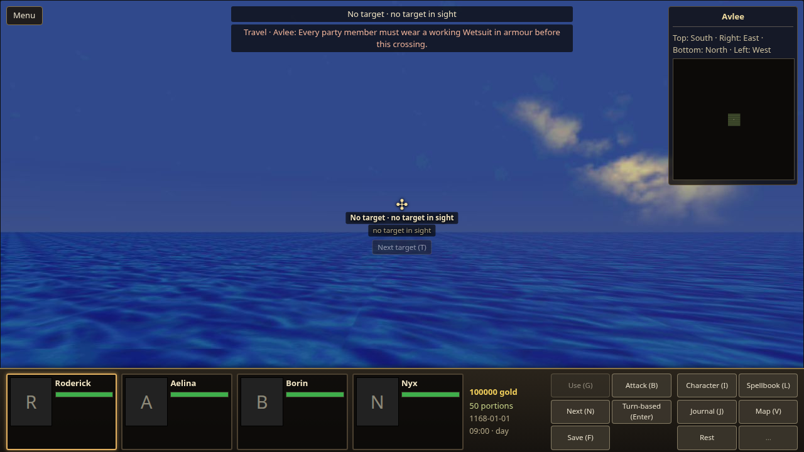
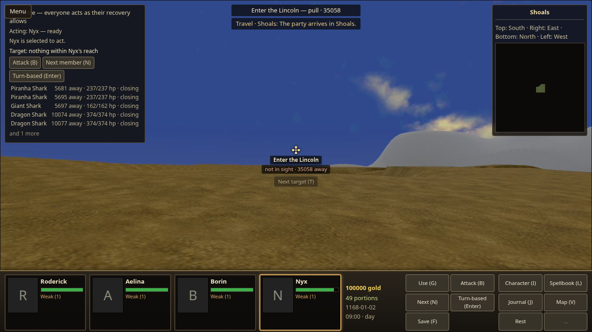
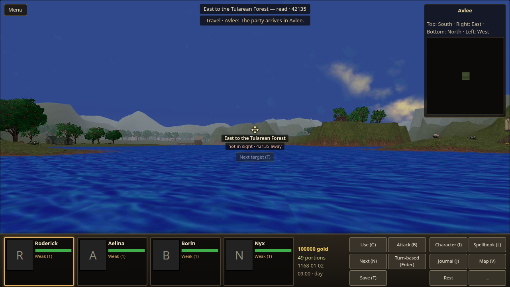
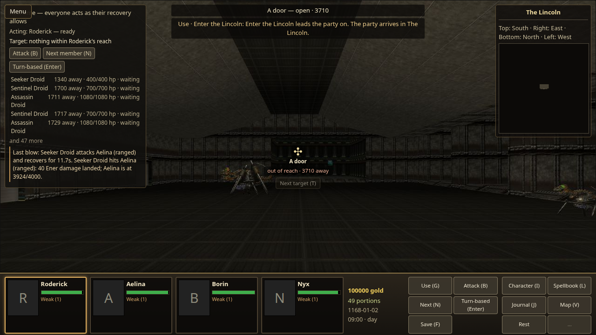
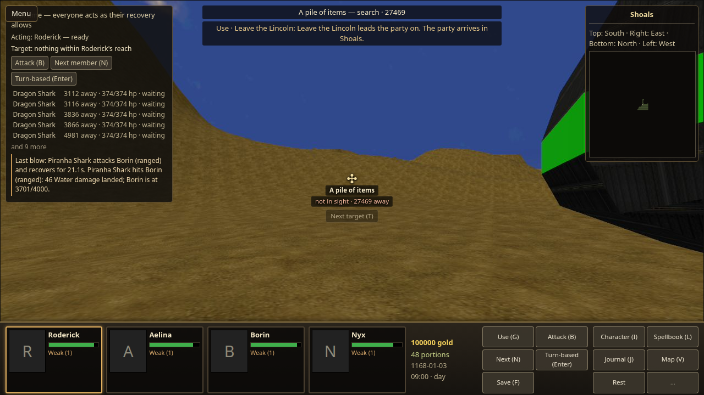
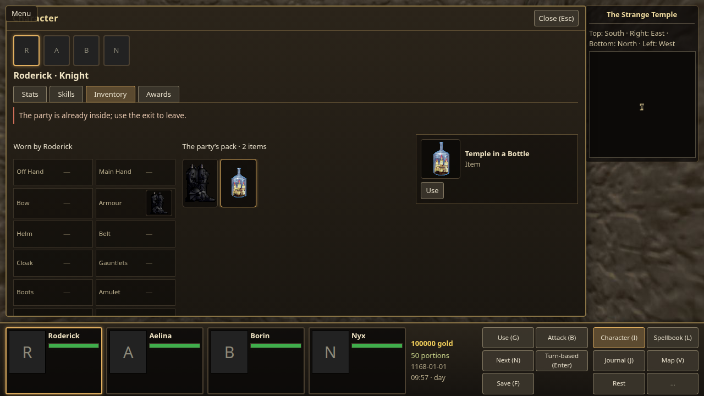
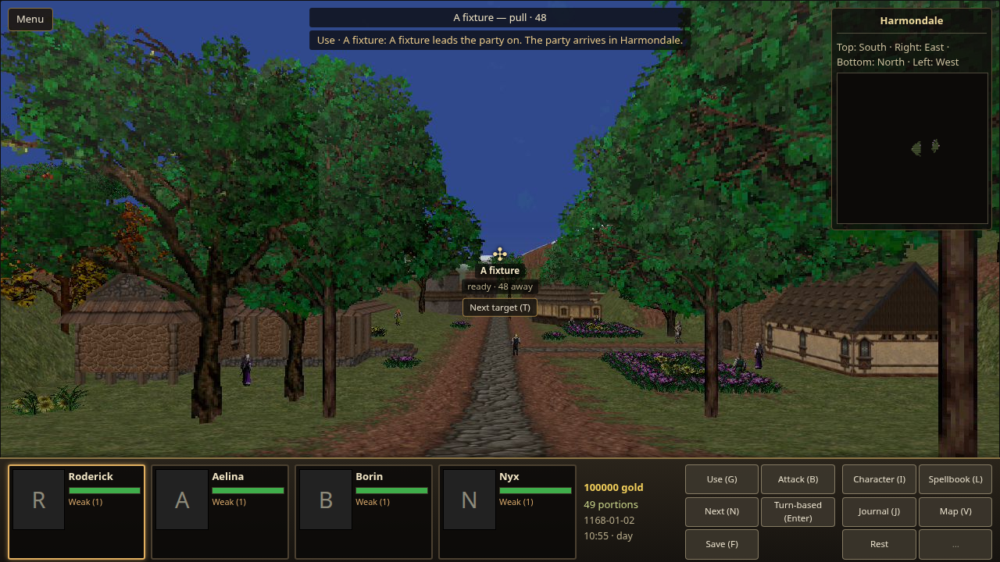
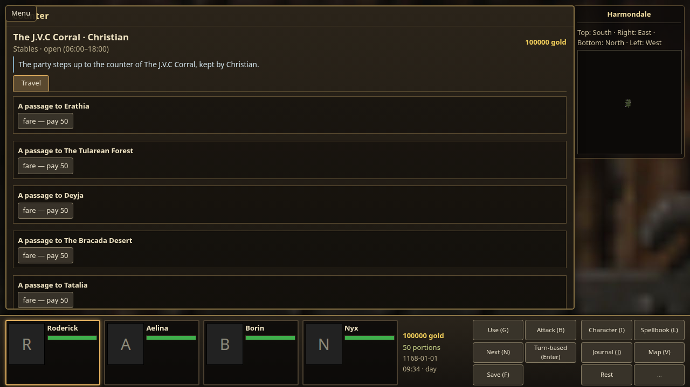
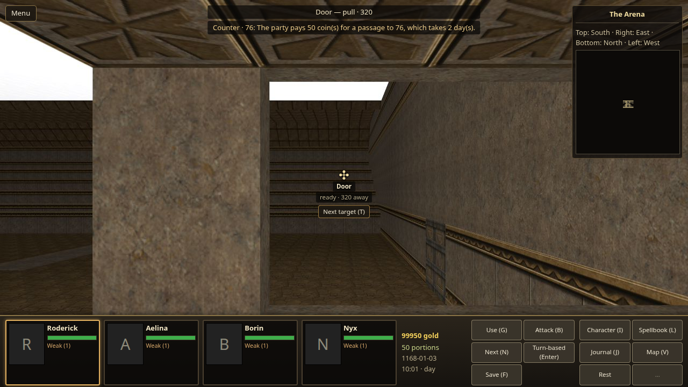
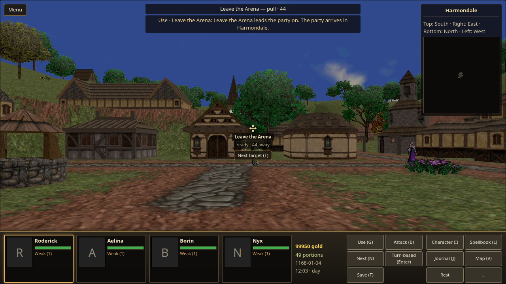

# Ordinary world routes

Recorded for Den task #9463 on 5 October 2026 (provenance only).

The ordinary bundle supplies 26 region boundaries, an Arena destination sold by
the real Harmondale stable, and the retained Temple in a Bottle item journey.
Every route enters the existing world transition owner. The original Lincoln
entrance and exit remain map-event fixtures. All members need working Wetsuits
for the Avlee-to-Shoals crossing; the suits occupy the real armour slot and provide
water-hazard shelter. The movement remains grounded rather than emulating the
original swimming controls.

The [whole-world report](world-routes-inventory.json) validates all 76 places,
305 transitions (85 fares), 1,049 entrances and 92 named arrivals. Its 76-place
reachability result is explicitly optimistic: it admits world-issued links and
ignores event gates, so it is not evidence of walking every route or completing
all prerequisites.

## Semantics and limits

OpenEnroth `src/Engine/Graphics/Outdoor.cpp:68-123,282-327` supplies road adjacency
and the suit gate; `src/Engine/mm7_data.h:131` identifies the boundary coordinate.
OpenEnroth `src/GUI/UI/Houses/Transport.cpp:38-95` identifies the Arena destination
of the Harmondale stable. Our coach schedule and duration use the existing fare
policy, rather than the original Sunday-only four-day special route.
OpenEnroth `src/Engine/Objects/Character.cpp:3550-3552` and
OpenEnroth `src/Engine/Engine.cpp:1501-1510` identify the retained bottle journey.

Road arrival points use source-named entries where available, with the existing
party start as the documented adaptation elsewhere. The source temple exit has
an X coordinate outside Harmondale's terrain; the importer normalizes that one
source quirk to Harmondale's actual party-start entry and records the original X.
No travel ticket is charged until arrival is admitted. A refused region boundary
keeps the party inside, allowing another ordinary outward step after eligibility
changes. Spherical entrances retain entry-trigger behavior.

## Visible evidence

Checks use private content copies with authored high-health parties, supplies,
working suits and starts near the actual route. This establishes the controls and
route effects, not ordinary item acquisition or campaign progression. Browser and
Engine assist actions hold time between observations; no diagnostic travel or
state mutation substitutes for the visible controls.

Original capture identities and byte digests are in [the capture index](world-routes/captures.json).
The copies below are unmodified.

The missing-suit refusal, Nyx's ordinary inventory equip, and the west crossing
into Shoals were observed in one session. The arrival shows Shoals, travel feedback,
one day elapsed and one provision spent. The initial bounded return attempt did
not complete the return, so that capture is not counted as a return proof.

The eastbound return was checked from a separate start just inside Shoals' actual
east boundary, all four suits equipped. One 200 ms ordinary forward action crossed
to Avlee; the visible banner, place title and provisions confirm arrival. This is
a bounded boundary check, not a traversal across the whole underwater region.
Session `b4a5b454-206e-4ba9-9edd-5948466db136` stopped and released its slot.

The original Lincoln fixture was approached from Shoals and used with G. After
arrival inside The Lincoln, an ordinary turn and G on its exit returned to Shoals.
Each crossing spent one day and one provision under the adapted travel policy.
Session `befeae70-1a2e-43dc-8185-2d86bcabec91` stopped and released its slot.
The first private test start overlapped collision geometry and was discarded; the
accepted start stood outside the ship and walked to the unchanged fixture.

The bottle was used from the shared inventory in Harmondale. The place title
changed to The Strange Temple while the item remained in the pack. A repeated
Use gave the explicit already-inside refusal. Closing the character book, walking
to the actual fixture and pressing G returned to Harmondale with arrival feedback.
The outgoing item journey costs no travel day; the existing exit link spends one
day and one provision under the normal transition policy. The all-member Weak
condition after that day is visible, rather than hidden by the staged health.
Session `18e4b1cd-56b1-4b4b-9c7c-aa466d6633f7` stopped and released its slot.

At the real Harmondale stable, movement and G opened Christian's conversation.
The coach fare screen offered The Arena, charged 50 gold, and advanced two days
on purchase. The Arena title and fare feedback confirm arrival. Ordinary movement
to the map's Leave the Arena fixture and G returned to Harmondale, spending the
exit link's day and one provision. No Arena stable was invented.

The first live attempt exposed an importer error: averaging disconnected door and
trim faces placed the counter inside the stable. The generic derivation now picks
one real door ahead of trim and retains a raised door's sill height. The accepted
retry starts near that derived door; its position was not overridden in staging.
Session `7759efff-7a04-484f-91ed-ddb625d44b62` stopped and released its slot.

The counter screenshot shows the top of its bounded fare list, not the scrolled
Arena offer. The [original DOM click record](world-routes/arena-fare-action.json)
preserves the seventh fare selection; the arrival frame shows its actual result.

## Semantic checks

Focused route checks cover eligibility, broken/missing suits, admission before
payment, authored arrivals, retained item travel and save/resume/exit. Boundary
regressions cover all axes/directions, altitude independence and refusal followed
by a successful retry. Importer regressions cover one-face door selection and
raised landings. The final importer suite passed 213 cases; the final imported
content/graph/route sweep passed six cases with all operator data present.
